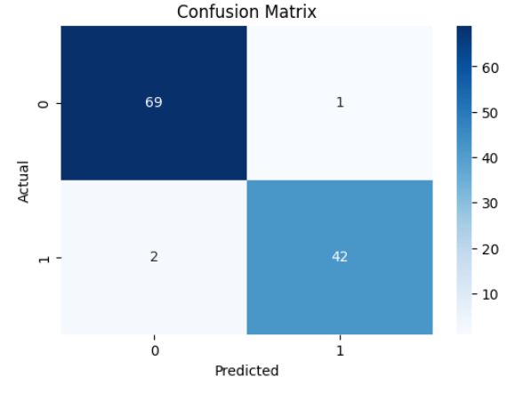
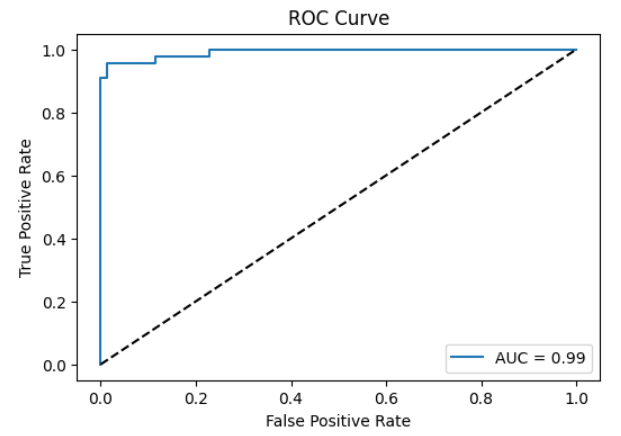
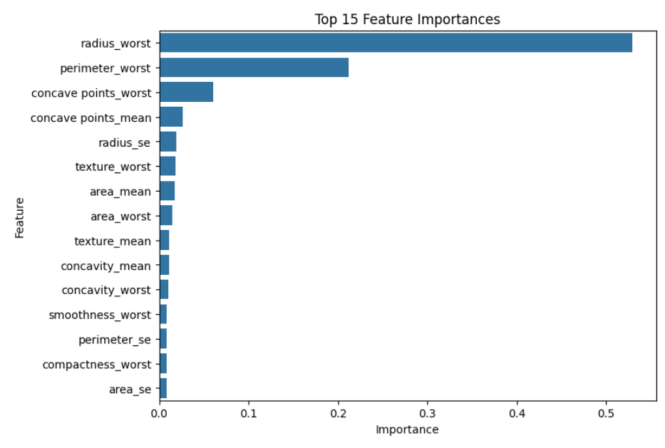
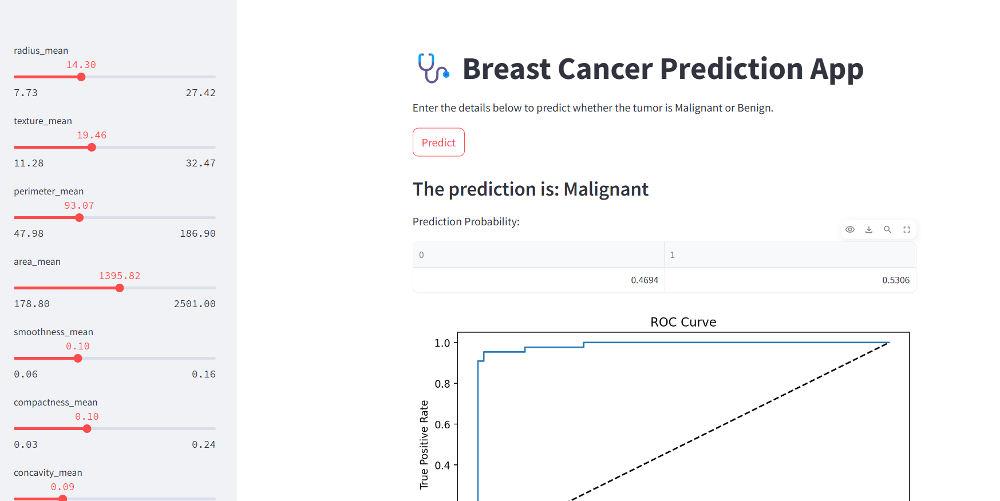

# 🎗️ Breast Cancer Prognostic Prediction with XGBoost 🚀


A robust machine learning pipeline for breast cancer prognosis prediction using XGBoost classifier with hyperparameter tuning and comprehensive evaluation.

## 🌟 Overview
This project demonstrates an end-to-end workflow for binary classification of breast cancer diagnosis (Malignant/Benign) using:
- Advanced preprocessing pipelines
- Hyperparameter tuning with GridSearchCV
- XGBoost classifier optimization
- Detailed performance visualization
- Model persistence with joblib

**🔗 Try in Google Colab:** [](https://colab.research.google.com/github/SanyaShresta25/Breast-Cancer-Prognostic-Prediction/blob/main/breast_cancer_xgboost.ipynb)

## 📊 Key Features
- 🧹 Automated data preprocessing (missing value imputation + scaling)
- ⚙️ Hyperparameter optimization with 5-fold cross-validation
- 📈 Multiple evaluation metrics (Accuracy, ROC-AUC, Precision/Recall)
- 📊 Interactive visualizations (Confusion Matrix, ROC Curve, Feature Importance)
- 💾 Model persistence and prediction exports

## 🧠 Dataset
**Wisconsin Diagnostic Breast Cancer (WDBC)** dataset:
- 569 samples with 30 tumor features
- Features include radius, texture, perimeter, area, smoothness, etc.
- Binary target: `diagnosis` (Malignant = 1, Benign = 0)

**Source:** [UCI Machine Learning Repository](https://archive.ics.uci.edu/ml/datasets/Breast+Cancer+Wisconsin+(Diagnostic)) | [Kaggle Version](https://www.kaggle.com/uciml/breast-cancer-wisconsin-data)

## 🛠️ Installation
```bash
pip install xgboost scikit-learn pandas matplotlib seaborn joblib
```

## 🚀 Usage
1. Clone the repository:
```bash
git clone https://github.com/SanyaShresta25/Breast-Cancer-Prognostic-Prediction.git
cd Breast-Cancer-Prognostic-Prediction
```
2. Download [breast_cancer.csv](https://www.kaggle.com/uciml/breast-cancer-wisconsin-data) and place it in the project root
3. Run the Jupyter notebook/Google Colab

## ⚙️ Hyperparameter Tuning
| Parameter        | Tested Values          | Best Value |
|------------------|------------------------|------------|
| `n_estimators`   | [50, 100, 150]        | 150        |
| `max_depth`      | [3, 4, 5]             | 3          |
| `learning_rate`  | [0.01, 0.1, 0.2]      | 0.1        |
| `subsample`      | [0.8, 1]               | 0.8        |

**Grid Search Details:**  
- 5-fold cross-validation
- Scoring metric: Accuracy
- Total combinations: 54

## 📈 Results
### Model Performance
| Metric               | Score    |
|----------------------|----------|
| **Test Accuracy**    | 97.37%   |
| **ROC-AUC Score**    | 99.56%   |
| **Precision** (Malignant) | 96.55% |
| **Recall** (Malignant)    | 96.55% |

### Visualizations
  
  



## 📂 Output Files
1. `xgboost_breast_cancer_model.pkl` - Serialized best model
2. `breast_cancer_predictions.csv` - Actual vs Predicted results
3. `grid_search_results.csv` - Complete GridSearchCV results

## 📧 Contact
For questions/suggestions:  
📩 [shrestasanya@gmail.com](mailto:shrestasanya@gmail.com)

## 🙏 Acknowledgments
- Dataset providers: Dr. William H. Wolberg, University of Wisconsin
- XGBoost development team
- Scikit-learn contributors

**💡 Pro Tip:** For best results:
1. Ensure dataset matches the required format
2. Use GPU acceleration in Colab for faster GridSearch
3. Monitor training with XGBoost's built-in callbacks

